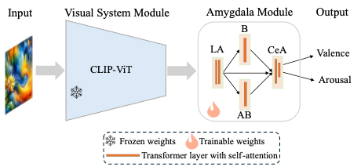
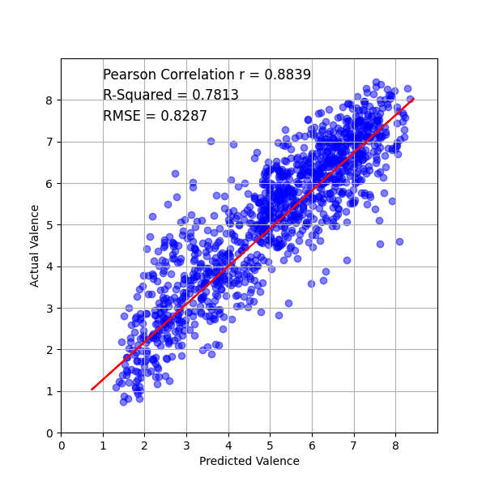
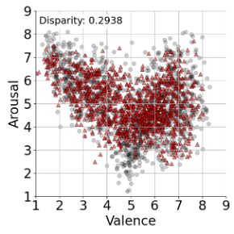

# Biologically Inspired Deep Neural Network Models for Visual Emotion Processing (VCA)

This repository accompanies the VCA model described in our bioRxiv preprint. It contains code for training, testing, and inference.

Preprint: [bioRxiv](https://www.biorxiv.org/content/10.1101/2025.10.20.683439v1) • DOI: https://doi.org/10.1101/2025.10.20.683439

### Citation

Biologically Inspired Deep Neural Network Models for Visual Emotion Processing  
Peng Liu, Ke Bo, Yujun Chen, Andreas Keil, Mingzhou Ding, Ruogu Fang  
bioRxiv 2025.10.20.683439; doi: https://doi.org/10.1101/2025.10.20.683439

## Folder Structure

```
VCA/
├── README.md                    # This file
├── LICENSE                      # License file
├── requirements.txt             # Python dependencies
├── image/                       # Sample figures for documentation
├── models/                      # Model definitions
│   └── VCA.py
├── training/                    # Training scripts
│   ├── train.py                 # Training entry point
│   └── train.sh                 # sbatch template (fill placeholders)
├── testing/                     # Testing scripts
│   ├── test.py                  # Testing entry point
│   └── test.sh                  # sbatch template (fill placeholders)
├── inference/                   # Inference scripts
│   ├── Inference.py             # Standalone inference script
│   └── infer.sh                 # sbatch template (fill placeholders)
├── trained_models/              # Place pretrained model weights here
│   └── [model files .pth]       # Model weight files
└── utils/                       # Utility functions
    ├── utils.py                 # Model utilities (initialize_model, save_checkpoint, etc.)
    └── dataloader.py            # Data loading functions
```

## Model Overview

**VCA** is a vision transformer model that:
- Uses CLIP (Contrastive Language-Image Pre-training) as the backbone
- Processes CLIP image features through transformer encoder layers
- Implements an amygdala-inspired architecture with:
  - LA (Lateral Amygdala) pathway: 2-layer transformer encoder
  - BA (Basal Amygdala) pathway: 1-layer transformer + FC layer
  - BL (Basolateral Amygdala) pathway: 1-layer transformer + FC layer
  - CE (Central Amygdala) pathway: Combines LA, BA, BL features through 2-layer transformer
- Predicts valence and arousal ratings (emotion perception)

<p align="center">
  
  
</p>
<p align="center"><em>Fig. 1a: Structure of the network.</em></p>

Detailed module configuration:
- **CLIP Backbone**: Frozen ViT-L/14 or ViT-B/32 encoder
- **LA Module**: 2-layer TransformerEncoder (d_model=768/512, nhead=4, dim_feedforward=512)
- **BA Module**: 1-layer TransformerEncoder (nhead=1) + Linear(→256) + ReLU + Dropout
- **BL Module**: 1-layer TransformerEncoder (nhead=1) + Linear(→256) + ReLU + Dropout
- **CE Module**: 2-layer TransformerEncoder (d_model=LA+BA+BL, nhead=2, dim_feedforward=512) + Linear + ReLU + Dropout(0.5)
- **Output**: Linear layer predicting 1 or 2 outputs (valence and/or arousal)

## Key Files Description

### Model Definition
- **models/VCA.py**: The main model class definition

### Training
- **training/train.py**: Main training script that:
  - Supports multiple training runs with repeat functionality
  - Implements train/validation split (default 90:10)
  - Dual-head loss: SmoothL1Loss for arousal, MSELoss for valence, with adaptive weighting (0.7/0.3 early → 0.5/0.5 late)
  - Multiple LR schedules: `step`, `cyclic`, `cyclic_plateau`
  - Early stopping support (disabled by default)
  - Saves model checkpoints (best validation R² and optional per-epoch)
  - Evaluates on test data after training
  - Generates scatter plots, training history plots, and per-epoch CSV logs
  - Quantile-based performance analysis

### Testing
- **testing/test.py**: Testing script that:
  - Loads a trained model
  - Tests on a test dataset
  - Computes metrics (Pearson correlation, R², RMSE)
  - Generates scatter plots and quantile analysis

### Inference
- **inference/Inference.py**: Standalone inference script that:
  - Supports unlabeled image folders (no CSV required)
  - When CSV is provided: runs evaluation with metrics (outputs `test_results.csv`)
  - When no CSV: runs inference only (outputs `inference_results.csv`)

### Utilities
- **utils/utils.py**: Contains:
  - `initialize_model()`: Model initialization function
  - `save_checkpoint()`: Save model checkpoint (legacy version)
  - `save_checkpoint_V2()`: Save model checkpoint (with R2 and RMSE)
  - `perform_quantile_analysis()`: Quantile-based performance analysis
  - `GaussianBlur`: Data augmentation class

- **utils/dataloader.py**: Contains:
  - `collate_with_names()`: Custom collate function that preserves image filenames in batches
  - `RegressionDataset`: Dataset class for regression tasks
  - `SubsetWithTransform`: Dataset subset with transformations
  - `data_transform()`: Image transformation pipeline (training augmentations: rotation, flip, Gaussian blur; test-time augmentations: noise, color shift, lighting, grayscale)
  - `reg_dataloader_KFold()`: DataLoader for training/validation
  - `reg_dataloader_testdata()`: DataLoader for testing

## Usage

### Training

```bash
python training/train.py \
  --data_dir /path/to/data \
  --train_data KNV_combine \
  --train_csv_data KNV_combine.csv \
  --test_data IAPS \
  --test_csv_data IAPS.csv \
  --batch_size 128 \
  --epoch 50 \
  --lr 1e-3 \
  --lr_schedule_type cyclic_plateau \
  --lr_min 1e-5 \
  --lr_peak_epoch 5 \
  --lr_cycle_end_epoch 30 \
  --step_size 40 \
  --model_dir /path/to/save/models \
  --model_name KNVCombined_M71_ViTL14_Amy_Transformer_lr1e3_bs128_ep50_YYYYMMDD_PredictBoth.pth \
  --logfolder KNV_M71_ViTL14_Amy_Transformer_lr1e3_bs128_ep50_YYYYMMDD_PredictBoth \
  --resultfolder /path/to/save/results \
  --validation_performances history_repeat.csv \
  --is_log False \
  --resume None \
  --start_epoch 0 \
  --model_to_run 71 \
  --image_size 224 \
  --is_predict_two True \
  --isarousal False \
  --clip_model_name "ViT-L/14" \
  --split_ratio 0.9 \
  --repeat 1 \
  --is_saveModel_epoch True \
  --early_stop_patience 0 # no early stop if it is 0
```

**Key Training Arguments:**
- `--model_to_run`: Model ID (71 for VCA)
- `--data_dir`: Root directory containing training and test data folders
- `--train_data`: Name of training data folder (inside data_dir)
- `--train_csv_data`: CSV file with training labels (inside data_dir)
- `--test_data`: Name of test data folder (inside data_dir)
- `--test_csv_data`: CSV file with test labels (inside data_dir)
- `--epoch`: Number of training epochs
- `--lr`: Learning rate
- `--clip_model_name`: CLIP model to use ("ViT-L/14" or "ViT-B/32")
- `--is_predict_two`: Set to "True" to predict both valence and arousal
- `--model_dir`: Directory to save trained models
- `--resultfolder`: Directory to save training results

### Testing

This section provides step-by-step instructions for setting up and testing pretrained models.

#### Step 1: Download Model Weights

Trained model weights are hosted on Zenodo: [https://zenodo.org/uploads/18736264](https://zenodo.org/uploads/18736264)

1. **Download the model:**

   - Via browser: visit the [Zenodo record](https://zenodo.org/uploads/18736264) and download the `.pth` file.
   - Via CLI:
     ```bash
     cd VCA/trained_models
     # Download from Zenodo (replace the URL with the direct file link from the record)
     wget -O model.pth "https://zenodo.org/uploads/18736264/files/<FILENAME>.pth"
     ```

2. Place the `.pth` file in `trained_models/`. If you use a different filename or location, pass it with `--model_path` (for `testing/test.py`) or set `MODEL_PTH=/abs/path/to/model.pth` when submitting sbatch.


#### Step 2: Prepare Test Data

You need:
1. **CSV file** with test labels (format: `filename, extension, arousal, valence`)
2. **Image directory** containing the test images

Example CSV format (**no header row**; columns are: filename, extension, arousal, valence):
```
1001,jpg,5.2,6.8
1002,jpg,4.5,5.3
...
```

#### Step 3: Run Testing

From the `VCA` directory:

**Using default model location** (if the model is in `trained_models/` with the default name, you can omit `--model_path`):
```bash
python testing/test.py \
  --csv_path /path/to/your/test.csv \
  --img_dir /path/to/your/test/images \
  --model_to_run 71 \
  --is_predict_two True \
  --clip_model_name "ViT-L/14" \
  --resultfolder results/test_output
```

**Expected Output:**

```
Initializing model
model 71 to run: VCA 
Loading model
Preparing test data
Applying data transformations...
Image size: 224
Testing model
Saving results
----------
Test - r_Arousal: 0.6806, R2_Arousal: 0.4632, RMSE_Arousal: 0.8449, 
      r_Valence: 0.8842, R2_Valence: 0.7818, RMSE_Valence: 0.8277
Pearson Correlation: 0.6806233840417137
R-Squared (line vs actual): 0.46324819326400757
RMSE (line vs actual): 0.8448663
Pearson Correlation: 0.8842066132621943
R-Squared (line vs actual): 0.7818213701248169
RMSE (line vs actual): 0.8276925
Arousal- Quantile analysis for 25th percentile: {'Pearson Correlation': 0.9786, 'R² Score': 0.3176, 'RMSE': 0.9482}
Valence- Quantile analysis for 25th percentile: {'Pearson Correlation': 0.9943, 'R² Score': 0.9694, 'RMSE': 0.3100}
Test complete. Outputs saved to: results/test_output
```

**Output Files:**
- `test_Arousal_scatter_plot.png` - Scatter plot for arousal predictions
- `test_Valence_scatter_plot.png` - Scatter plot for valence predictions
- `test_Arousal_actual_predicted.csv` - Arousal predictions vs actual
- `test_Valence_actual_predicted.csv` - Valence predictions vs actual
 

### Example Plot

<p align="center">
  
  
</p>


### Joint Prediction Overlay in Valence–Arousal Space

<p align="center">
  
  
</p>

The figure shows predicted valence–arousal (red) overlaid on target ground truth (gray) in the 2D affective space.


### Inference

For batch inference on unlabeled images (no CSV required):

```bash
python inference/Inference.py \
  --model_path trained_models/KNVCombined_M71_ViTL14_Amy_Transformer_lr1e3_bs128_ep50_YYYYMMDD_PredictBoth_repeat1.pth \
  --test_img_dir /path/to/images \
  --batch_size 128 \
  --image_size 224 \
  --resultfolder results/inference_output \
  --model_to_run 71 \
  --is_predict_two True \
  --clip_model_name "ViT-L/14"
```

SLURM submission (sbatch templates available):

```bash
# Fill in placeholders in inference/infer.sh, then submit:
sbatch inference/infer.sh
```

Override checkpoint at submit time if needed:

```bash
MODEL_PTH=/abs/path/to/model.pth sbatch inference/infer.sh
```

Outputs a CSV with columns: `Image Name`, `Predicted Valence`, `Predicted Arousal`.
- Without CSV labels: `inference_results.csv`
- With CSV labels: `test_results.csv` (includes actual values and metrics)

### sbatch templates for training and testing

Training (sbatch):

```bash
# Edit placeholders in training/train.sh, then submit:
sbatch training/train.sh
```

Testing (sbatch):

```bash
# Edit placeholders in testing/test.sh, then submit:
sbatch testing/test.sh
```

Notes:
- The sbatch scripts are templates with placeholders like <JOB_NAME>, <PARTITION>, <PATH_TO_CONTAINER>, etc. Replace them with values for your cluster.
- Environment variables (e.g., MODEL_PTH) can be set inline when submitting.

### When to use testing/test.py vs inference/Inference.py

- **Use `testing/test.py`** when you have ground-truth labels and want evaluation.
  - Inputs: CSV with labels, image directory, model checkpoint (or default).
  - Outputs: r/R²/RMSE metrics, scatter plots, quantile analysis, CSVs of actual vs predicted.
  - Typical: benchmarking a model on a labeled test set.

- **Use `inference/Inference.py`** when you only need predictions (no labels).
  - Inputs: image directory and model checkpoint. CSV optional; if provided, metrics will be computed.
  - Outputs: `inference_results.csv` (no labels) or `test_results.csv` (with labels and metrics).
  - Typical: applying the model to new or real-world unlabeled data.

## Key Parameters

- `model_to_run`: Set to `71` for VCA
- `clip_model_name`: CLIP model to use (default: "ViT-L/14")
- `is_predict_two`: Whether to predict both valence and arousal (default: True)
- `is_predict_two=True`: Predicts valence and arousal separately
- `num_class`: Number of classes (None for regression, integer for classification)

## Dependencies

Install all dependencies:
```bash
pip install -r requirements.txt
```

Required packages:
- torch
- torchvision
- torchsummary
- clip (OpenAI CLIP, installed from `git+https://github.com/openai/CLIP.git`)
- numpy >= 1.23
- pandas >= 1.5
- scipy >= 1.9
- scikit-learn >= 1.2
- Pillow >= 9.0
- matplotlib >= 3.6

## Notes

- The CLIP model weights are frozen during training
- Only the transformer layers and FC layers are trainable
- Input images are resized to 224x224
- The model expects RGB images
- CSV files should have no header row, with format: `filename, extension, arousal, valence`
- First run will download CLIP ViT-L/14 model (~900 MB) - ensure internet connection
- Model files are large (~1-3 GB), ensure sufficient disk space
- Testing may take time depending on dataset size
- GPU recommended but not required (will be slower on CPU)
- Default model expects ViT-L/14 CLIP backbone

 